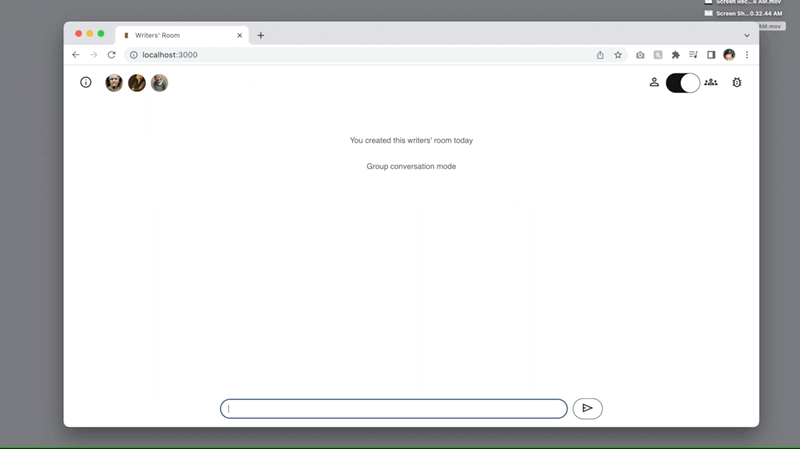
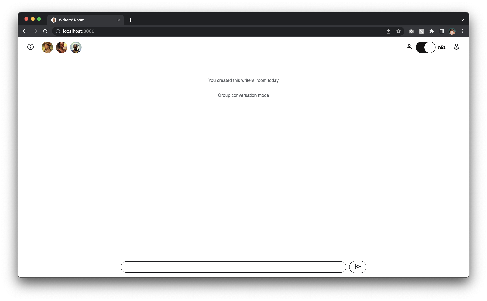
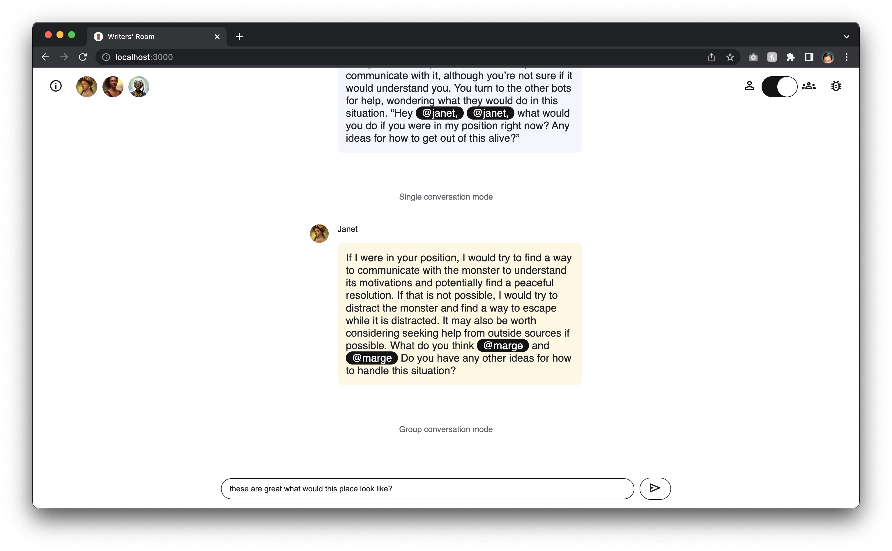
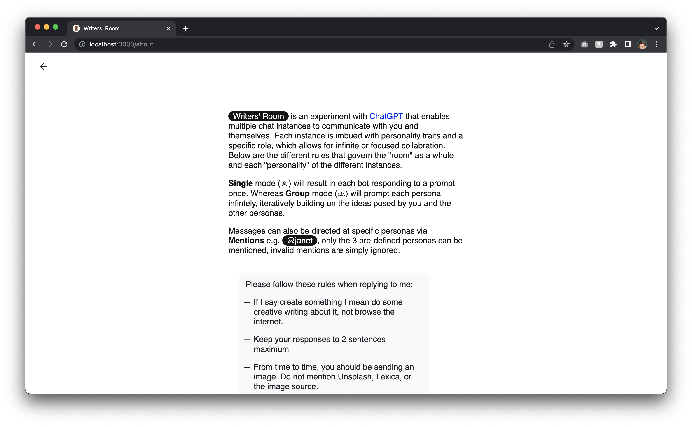

# Writers' Room

v0.1.3

### Workshop ideas with a room of bots.

---
### Overview

[Watch the demo](https://youtu.be/eHj0Ar3BBwo)

Writers' Room is an experiment with [ChatGPT](https://chat.openai.com/) that enables multiple AI bot instances to communicate with you and themselves. Each instance is imbued with personality traits and a specific contribution role, which allows for infinite or focused collaboration.

**Single** mode will result in each bot responding to a prompt once. Whereas **Group** mode will prompt each persona infinitely, iteratively building on the ideas posed by you and the other personas.

Messages can also be directed at specific personas via **Mentions** (e.g. @janet), only the 3 pre-defined personas can be mentioned, invalid mentions are simply ignored.

---
### Getting Started

**Prerequisites**

1. Create an [OpenAI account](https://auth0.openai.com/u/signup/)
2. Make sure you have **Node 18.0+** installed. I recommend [nvm](https://github.com/nvm-sh/nvm#installing-and-updating) for handling Node versioning.

**Download, Build, and Serve**

1. Clone this repository into directory of your choice. `git clone https://github.com/frederickk/writers-room.git`
2. Install necessary dependencies `npm install`
3. Create a `.env` file, add your OpenAI login credentials `OPENAI_EMAIL="..."` and `OPENAI_PASSWORD="..."`
4. [Build](#build) `npm run build`
5. Serve `npm run serve`.
6. Open [localhost:3000](https://localhost:3000/)
7. Et voilà!

---
### Build

| Command | Description |
| ------- | ----------- |
| `npm run build` | Runs Webpack build process once |
| `npm run clean` | Cleans `./build` and any cached files |
| `npm run dev`   | Runs Webpack build process and watches for changes; rebuilding as necessary |
| `npm run serve` | [`http://localhost:3000`](http://localhost:3000) |

